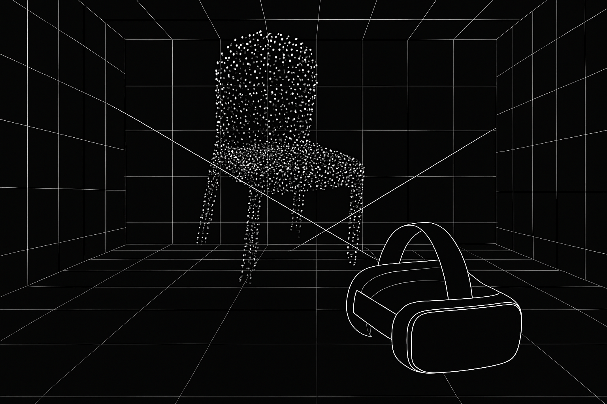
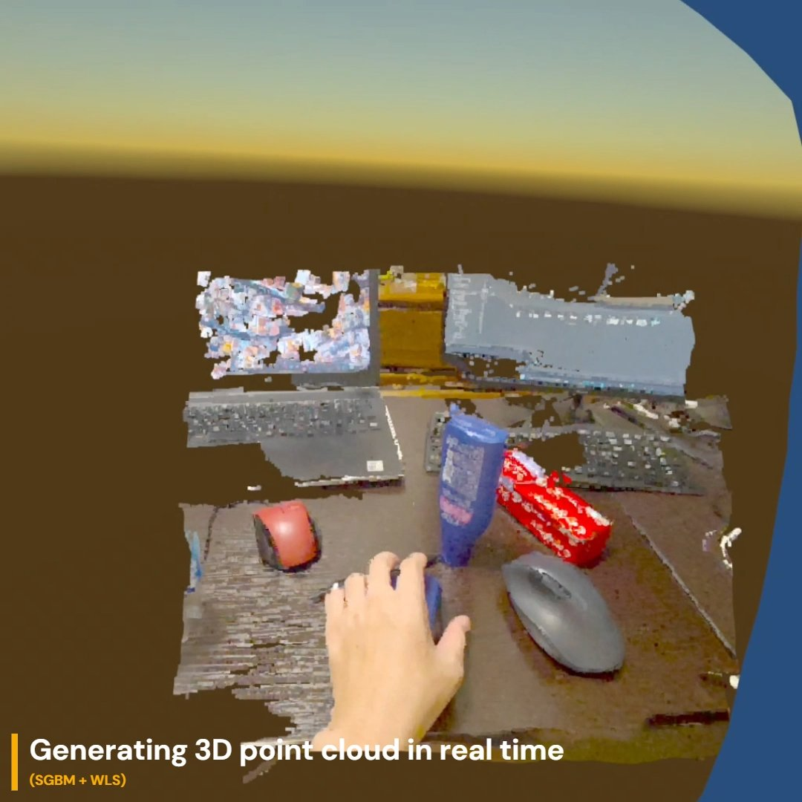

# Quest Stereo Matching

  

## Overview

Quest Stereo Matching is a real-time stereo matching application for Meta Quest 3 / 3s.
It generates and displays a 3D point cloud in real time using stereo camera input.

> **Since v1.1.0**: You can use **BANet** ([gangweix/BANet](https://github.com/gangweix/BANet)) as an inference backend (via ExecuTorch/XNNPACK).
> The backend can be switched from **StereoRunner**, and both **SGBM** and **BANet** parameters are editable via the **config object attached to StereoRunner**.

## YouTube

  

## Features

* Real-time stereo matching with:

  * **SGBM + WLS filtering**
  * **BANet backend (ExecuTorch/XNNPACK)** — *available since v1.1.0; switchable from StereoRunner; parameters for both backends editable via the attached config object*
* Direct visualization of the generated 3D point cloud in VR
* Pause and resume processing using either:

  * Left controller **menu button**
  * **Pinch gesture** with the left hand (hand tracking)

## Usage

1. Install the application on your Quest 3 / 3s.
2. On the first launch, grant the requested permissions when prompted.
3. The application will start processing automatically.
4. Use the left controller menu button or left-hand pinch gesture to pause/resume processing.

## Configuration

* All stereo matching parameters are exposed via the **StereoRunner** component in the Unity Inspector.
* **Since v1.1.0**:

  * You can **switch the inference backend (SGBM ↔ BANet)** directly on **StereoRunner**.
  * **SGBM** and **BANet** parameters can be edited via the **config ScriptableObject attached to StereoRunner**.

## Build

* The repository contains a Unity project under the `unity` subdirectory.
* Prebuilt APKs are available in the [Releases](https://github.com/t-34400/QuestStereoMatching/releases) section.

## Notes

When configured for a target frequency of 10 Hz, the application typically shows an average latency of around 0.3 seconds.

## Acknowledgements

This project makes use of the following open-source projects:

* [OpenCV](https://opencv.org/)
* [OpenCV Contrib](https://github.com/opencv/opencv_contrib) (`ximgproc` module)
* **[BANet](https://github.com/gangweix/BANet)** — used as a neural stereo backend since v1.1.0

We would like to thank the authors and contributors of these projects.
Users and developers are expected to comply with the respective licenses of these dependencies.

## License

This project is licensed under the [MIT License](LICENSE).
